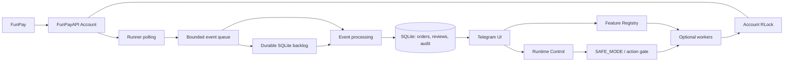

[Русский](README.ru.md) | English

# FunPayFlow

FunPayFlow is an open-source automation and analytics toolkit for FunPay
sellers, with Telegram-based management. This FunPay bot supports seller
automation through lot autobump, order notifications, sales history,
statistics, sales analytics, and official export import. The public installer
supports Windows 10/11 and Ubuntu-like Linux VPS hosts with Python 3.13.

FunPayFlow is an independent open-source project and is not affiliated with
or endorsed by FunPay.

**Quick links:** [Windows](#windows) · [Linux/VPS](#linuxvps) ·
[First Telegram launch](#first-telegram-launch).

Recommended path after publication: **GitHub Releases →
`FunPayFlow-v1.0.0.zip` → extract → `Setup.bat` → `Start.bat`**.
Source-based installation is covered under [Development](#development-and-manual-installation).

The extracted release keeps `Setup.bat`, `Start.bat`, and these guides at the
top level. Python code and its `.venv` live under `app/`; Linux installation
files live under `linux/`. The data-directory resolver is internal to `app/`.
Keep these folders together when moving the release.

**The Telegram management interface is Russian-only in v1.0.** The RU/EN
choice in Setup changes installer and Start messages only.

Automation can modify your FunPay account. Review auto-reply text and the
platform rules. `SAFE_MODE` blocks automatic modifying actions.
<!-- Before publication: use only anonymized Main Menu, Modules, Statistics,
and Analytics screenshots; never include owner, order, or sales data. -->

## Features

- Ten built-in modules with setup profiles; changes take effect after restart.
- Lot auto-bump with cooldown tracking and bounded retries.
- Persistent order history and notifications for orders, messages, and reviews.
- SQLite-backed statistics and sales analytics with currency filtering.
- Preview and deduplicated import of the official FunPay ZIP export.
- Review requests and night auto-replies with separate switches and messages.
- Status, issues, action journal, logs, and `SAFE_MODE` in Telegram.
- Graceful restart from Telegram.

## Windows

1. Once the GitHub Release ZIP is published, extract it to a permanent folder,
   such as `C:\FunPayFlow`. Do not run it from inside the ZIP.
2. Run `Setup.bat` and choose Russian (default) or English. Setup uses an
   installed `uv`, or the official `astral-sh.uv` package via `winget`, then
   installs Python 3.13, syncs `uv.lock`, and opens local configuration.
   Administrator privileges are normally unnecessary. If `winget` is missing,
   install `uv` using the [Astral instructions](https://docs.astral.sh/uv/getting-started/installation/).
3. Setup stores private data in `%LOCALAPPDATA%\FunPayFlow`, **outside**
   the extracted program folder. Enter the FunPay Golden Key, Telegram bot
   token, numeric `ADMIN_ID`, and numeric `FUNPAY_USER_ID`. Secret fields are
   hidden and no online credential check occurs during setup. In a Windows
   console, you can paste a hidden secret with `Ctrl+V`.
   After the small bootstrap screen, Rich displays colored step panels and
   the real save operation. Its fixed secret mask reveals neither the value
   nor its length; narrow or basic terminals receive readable plain text.
4. Run `Start.bat`, leave its window open, and send `/start` to your bot.

After successful Setup, press Enter to close its window. When Setup is run
from an existing shell, that shell remains open.

On a rerun, Setup offers to keep the current `.env` (the default), edit it,
or cancel. The chosen installer language is saved separately in the private
`installer_language.txt`, which Start reads on later launches. Successful
dependency installation displays only short stages. If it fails, Setup shows
the location of `%TEMP%\FunPayFlow-setup.log` for detailed diagnostics.
Start uses the same presentation for local checks and a friendly
second-instance message. It does not claim a FunPay or Telegram connection
before the runtime confirms one.

Setup and Start use the same stable data directory. Start checks `.env` and
`.venv`; a process lock prevents a second bot instance from using that data.
If `%LOCALAPPDATA%` is unavailable, the path falls back to
`%USERPROFILE%\AppData\Local\FunPayFlow`. Advanced users can set an
absolute `FUNPAY_BOT_DATA_DIR` explicitly. There is no separate `Update.bat`.

## Linux/VPS

Extract the release or clone the project to a permanent location. Use an
ordinary account, not root:

```bash
bash linux/install.sh --code-dir "/home/seller/FunPayFlow/app" \
  --data-dir "/home/seller/.local/share/funpayflow"
```

Without flags, the script asks for both paths. It sets directory mode `700`
and `.env` mode `600`, installs `uv` and Python 3.13, syncs dependencies from
`uv.lock`, and runs local setup (Russian by default; `setup_config.py`
supports `--language en`). If `uv` is missing, the bootstrap is downloaded
from `https://astral.sh/uv/install.sh` into a file before execution. This
requires trusting Astral as the installer provider.

The optional `--systemd` flag installs a service with `sudo`. An existing
unit is not overwritten, and the new unit is enabled only after successful
setup. Manage it with:

```bash
sudo systemctl start funpayflow
sudo systemctl stop funpayflow
sudo systemctl restart funpayflow
sudo systemctl status funpayflow
sudo journalctl -u funpayflow -f
```

The template `linux/systemd/funpayflow.service.in` sets an explicit working
directory, executable, and private EnvironmentFile. It runs as the selected
non-root user. SIGTERM shuts down cleanly; failures restart after 10 seconds.
The Telegram restart control restarts the runtime within the same process.

## First Telegram launch

Send `/start`. The **Russian-only** wizard offers Minimal, Seller, All, or
manual module selection. All ten modules are selected by default on a fresh
installation, but start working only after configuration is saved and the
runtime restarts. Auto-bump is enabled automatically on the next startup of
an active module; `SAFE_MODE` still blocks its HTTP action. Night auto-reply
and review request each need their own switch. Set the primary currency in
Statistics or Analytics, not in Modules.

## Modules and currencies

Modules: `autobump`, `notifications`, `night_mode`, `review_request`,
`order_history`, `statistics`, `sales_analytics`, `sales_import`,
`withdrawals`, and `logs_ui`. Disabling a module takes effect after restart.
`order.currency` is the order's historical currency;
`primary_currency` is the current preferred currency. Analytics filters
USD, RUB, other observed currencies, or All. It never adds amounts from
different currencies or converts them. Reimporting an identical official
export does not duplicate sales or turnover.

## Private data, backup, and updates

An **absolute** `FUNPAY_BOT_DATA_DIR` contains `.env`, `bot_settings.json`,
`installer_language.txt`, `state.sqlite3` and WAL/SHM files, an optional
`stats_log.json`, `bot.lock`, `logs/`, and temporary ZIPs under `imports/`.
Windows Setup/Start derive the same stable location from the user profile and
set the variable before Python starts. The Linux unit sets it via Environment.
Manual development launches without the variable retain the old code-local
layout. **Legacy data is not migrated automatically.** Stop the bot, back up
the full data directory, and move all data together if changing layouts.

Before updating, stop the process or systemd service and copy the **entire**
data directory to a protected backup. On Windows, extract the new Release ZIP
to a new folder, run its `Setup.bat`, then `Start.bat`; the old `.env`,
settings, SQLite, and logs remain in `%LOCALAPPDATA%\FunPayFlow` and need
no manual copying. On Linux, install new code with the same `--data-dir`,
render a new unit with `render_service.py`, review and install it with
`sudo install`, then run `daemon-reload` and `restart`. Keep the old code and
backup until the update is verified. There is no hidden migration or online
self-update.

## Troubleshooting

| Symptom | Check |
| --- | --- |
| `winget`/`uv` missing | Install `uv` from Astral's official instructions and rerun Setup. |
| Start cannot find `.env` or `.venv` | Rerun Setup and check the private data directory. |
| Process lock / second instance | Stop the old process; do not remove an active bot's lock. |
| Telegram 409 Conflict | A token must be used by only one bot instance. |
| Incorrect FunPay ID/key | Edit local `.env`; never post values in an issue. |
| SQLite/settings unavailable | Check permissions, disk space, and your backup. |
| Monetary metrics unavailable | Choose a primary currency in Statistics/Analytics. |

## Architecture



The Runner and account operations share one Account and RLock. Events pass
through a bounded queue; critical observations are retained in a durable
SQLite backlog. Runtime Control manages restarts and the late action gate.

## Development and manual installation

Install [uv](https://docs.astral.sh/uv/getting-started/installation/)
and Python 3.13:

```text
uv sync --locked --dev
uv run --no-sync pytest -q
uv run --no-sync python tests/packaging_smoke.py
```

For a manual installation, set an absolute `FUNPAY_BOT_DATA_DIR`, create
`.env` with `uv run --no-sync python setup_config.py --data-dir <path>` or
use `.env.example`, then run `uv run --no-sync python main.py`. The official
ZIP CLI import uses the same SQLite database in the data directory.

## Security and privacy

Never publish `.env`, settings, SQLite, exports, logs, or backups. Enter
secrets locally, never through Telegram. `.env` is written atomically; on
Linux it has mode `600`. Windows directory permissions depend on the user
account and filesystem. Setup does not contact FunPay or Telegram; the
running bot does after startup.

## License

FunPayFlow is released under the MIT License. See LICENSE.
